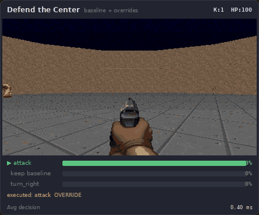

# Jeffy

Pretrained classifiers you can run and retrain on CPU — text, game state, or any numeric features.

<p align="center">
  
</p>
<p align="center">
  
  
</p>

## Try it

[Install uv](https://docs.astral.sh/uv/getting-started/installation/), then:

```bash
uvx --python 3.12 \
  --from "jeffy-classify @ git+https://github.com/nicobrenner/jeffy.git@v0.1.0-alpha.11" \
  jeffy-serve
```

Open http://localhost:8400, pick a classifier, and paste one of these:

| Classifier | Try this text |
|------------|---------------|
| banking77 | I was charged twice for the same transaction |
| sms_spam | WINNER! You have been selected for a free cruise. Reply YES to claim. |
| ag_news | The Federal Reserve raised interest rates by 25 basis points on Wednesday |

<p align="center">
  
</p>

## Pretrained capabilities

14 classifiers ship with the package, including a real-time Doom game-state classifier. Weights are logistic regression coefficients (derived model parameters, not copies of training data). Source datasets and licenses are documented in `ATTRIBUTION.md`.

| Task | What it does | Classes | Test Acc | Test F1 |
|------|-------------|---------|----------|---------|
| sms_spam | SMS spam detection | 2 | 99.1% | 98.0% |
| dbpedia | Wikipedia article category | 14 | 96.0% | 95.9% |
| imdb | Movie review sentiment (long text) | 2 | 94.8% | 94.8% |
| banking77 | Banking customer intent | 77 | 94.3% | 94.3% |
| ag_news | News topic (world/sports/business/tech) | 4 | 90.5% | 90.5% |
| sst2 | Movie review sentiment | 2 | 90.1% | 90.1% |
| clinc_oos | Voice assistant intent + out-of-scope | 151 | 88.4% | 92.1% |
| massive_intent | Smart home voice commands | 60 | 88.1% | 86.4% |
| tweet_eval_offensive | Offensive language | 2 | 81.0% | 74.8% |
| tweet_eval_emotion | Tweet emotion | 4 | 78.1% | 74.7% |
| emotion | Text emotion (6 emotions) | 6 | 75.5% | 67.8% |
| tweet_eval_sentiment | Tweet sentiment (3-way) | 3 | 66.2% | 65.7% |
| snli | Natural language inference | 3 | 65.6% | 65.2% |
| doom_fire | Doom game-state decisions (fire/turn) | 3 | 100.0% | 100.0% |

Test accuracy on held-out splits. Details in `data/eval_results/benchmark.json`. doom_fire operates on numeric feature vectors (24 game-state features) instead of text — see `examples/doom/`.

**Weaknesses:** SNLI (65.6%) and tweet_eval_sentiment (66.2%) are below what task-specific models achieve. Emotion (75.5%) has limited class coverage. Probabilities are uncalibrated.

## Train a custom classifier

```bash
uvx --python 3.12 \
  --from "jeffy-classify @ git+https://github.com/nicobrenner/jeffy.git@v0.1.0-alpha.11" \
  jeffy-train --example --save-dir my_models
```

```
Loaded 24 examples from reviews.csv
Training 'reviews': 24 examples, 2 classes
  Split: 19 train, 5 test
  Test accuracy: 100.0%
Saved to my_models/reviews/
```

`--example` uses a bundled 24-row product review CSV. To bring your own:

```bash
uvx --python 3.12 \
  --from "jeffy-classify @ git+https://github.com/nicobrenner/jeffy.git@v0.1.0-alpha.11" \
  jeffy-train --input your_data.csv --text-col text --label-col label \
  --task-id your_task --save-dir my_models
```

Supports `.csv`, `.tsv`, and `.jsonl`.

## Serve a custom model

```bash
JEFFY_PACK_DIR=my_models uvx --python 3.12 \
  --from "jeffy-classify @ git+https://github.com/nicobrenner/jeffy.git@v0.1.0-alpha.11" \
  jeffy-serve
```

```bash
curl -s -X POST http://localhost:8400/v1/predict \
  -H "Content-Type: application/json" \
  -d '{"text": "The battery life is amazing", "task": "reviews"}'
# → {"label": "positive", "confidence": 0.87, ...}
```

## Install from source

```bash
git clone https://github.com/nicobrenner/jeffy.git
cd jeffy

# With uv (recommended)
uv venv && uv pip install -e .

# Or with pip
python -m venv .venv && source .venv/bin/activate
pip install -e .
```

The first prediction downloads the shared encoder ([bge-large-en-v1.5](https://huggingface.co/BAAI/bge-large-en-v1.5), ~1.2 GB, cached afterward).

## API

### Python

```python
from jeffy.engine import Engine

engine = Engine()
engine.load()

# List available classifiers
for name, cap in engine.capabilities.items():
    print(f"{name}: {cap.description} ({cap.n_classes} classes)")

# Classify text
result = engine.predict("banking77", "I was charged twice for the same transaction")
print(result["label"])          # "transaction_charged_twice"
print(result["confidence"])     # 0.999
print(result["probabilities"])  # {"transaction_charged_twice": 0.999, ...}
```

### SDK walkthrough


### HTTP

```bash
# Banking intent
curl -s -X POST http://localhost:8400/v1/predict \
  -H "Content-Type: application/json" \
  -d '{"text": "I was charged twice for the same transaction", "task": "banking77"}'
# → {"label": "transaction_charged_twice", "confidence": 0.999, ...}

# Spam detection
curl -s -X POST http://localhost:8400/v1/predict \
  -H "Content-Type: application/json" \
  -d '{"text": "WINNER! You have been selected for a free cruise. Reply YES to claim.", "task": "sms_spam"}'
# → {"label": "spam", "confidence": 0.91, ...}

# News topic
curl -s -X POST http://localhost:8400/v1/predict \
  -H "Content-Type: application/json" \
  -d '{"text": "The Federal Reserve raised interest rates by 25 basis points on Wednesday", "task": "ag_news"}'
# → {"label": "Business", "confidence": 0.86, ...}
```

### List capabilities

```bash
curl -s http://localhost:8400/v1/capabilities | python3 -c "
import json, sys
for c in json.load(sys.stdin)['capabilities']:
    print(f\"{c['task_id']:25s} {c['n_classes']:3d} classes  {c['test_accuracy']:.1%}  {c['name']}\")"
```

### Per-capability metadata

Each shipped classifier has a `manifest.json` with label names, source dataset, HuggingFace path, stated license, encoder identity, training/test counts, and integrity hashes.

```bash
curl -s http://localhost:8400/v1/capabilities/banking77 | python3 -m json.tool
```

## Train from Python

```python
from jeffy.train import train_classifier

clf = train_classifier(
    texts=["great product!", "terrible service", "fast shipping", "broken on arrival"],
    labels=["positive", "negative", "positive", "negative"],
    task_id="my_reviews",
)

result = clf.predict("the quality exceeded my expectations")
print(result["label"])  # "positive"

clf.save("my_models")
```

### Tuning options

| Parameter | Default | Description |
|-----------|---------|-------------|
| `C` | 0.01 | How aggressively the model fits your data. Low (0.001) = conservative, keeps predictions closer to "I'm not sure." High (1.0) = trusts individual training examples more. If the model is great on training data but bad on new data (overfitting), lower C. |
| `test_size` | 0.2 | What fraction of your data to hold back for testing. With 100 examples at 0.2, it trains on 80 and tests on 20. Set to 0 to train on everything (useful when you have very little data and will test manually). |
| `cv_folds` | 3 | Cross-validation: splits your training data into 3 parts, trains on 2 and tests on 1, rotates three times, averages the scores. Gives a more reliable accuracy estimate than a single split. Set to 0 to skip (faster, less reliable estimate). |

Start with the defaults. With <50 examples per class, expect noisy estimates.

## Reproduce the evaluation

```bash
# Install with build dependencies
uv pip install -e ".[build]"
# or: pip install -e ".[build]"

# Retrain all 13 heads from source datasets (~40 min, downloads ~5 GB)
jeffy-build --out data/model_pack

# Evaluate on held-out test sets with tuned baselines
jeffy-evaluate --baselines --latency --device cpu
```

## Evaluation notes

- **SST-2**: Evaluated on `validation` split (official test labels are not public).
- **SMS Spam**: Random split (test_size=0.2, seed=42); no standard benchmark split.
- **SNLI**: Input encoded as `premise [SEP] hypothesis`. Label -1 filtered.
- **CLINC-OOS**: 151 classes including out-of-scope. In-scope accuracy 96.5%, OOS detection 51.7%.
- **MASSIVE**: English only (config `en`).

## Deployment

| Component | Size | Required for |
|-----------|------|-------------|
| Jeffy package (wheel) | 1.5 MB | Always (includes all 13 heads) |
| Encoder (bge-large-en-v1.5) | ~1.2 GB | Inference (downloaded on first use) |
| `datasets` package | ~100 MB | Retraining from HuggingFace only |

Runtime memory: ~2 GB (encoder loaded once, shared across all heads).

**Latency** (CPU, single example, Linux aarch64):

| Stage | p50 | Notes |
|-------|-----|-------|
| Embedding | 50–80 ms | Dominates; varies with input length |
| Classifier | <1 ms | Negligible |
| Total | 50–80 ms | End-to-end |

## Model security

Bundled pretrained artifacts use numpy `.npz` format (portable, no pickle). Custom-trained models also save a joblib pickle backup. **Only load custom pickle artifacts from trusted sources.** Each artifact's `manifest.json` includes integrity hashes verified on load.

## Provenance and licensing

Jeffy code is MIT-licensed. Head artifacts are derived from public datasets; redistribution permissions have **not been independently verified** for all sources. See `ATTRIBUTION.md` for per-dataset license status.

| Dataset | Stated license |
|---------|---------------|
| banking77, massive_intent, sms_spam | CC BY 4.0 |
| clinc_oos | CC BY 3.0 |
| dbpedia | CC BY-SA 3.0 |
| snli | CC BY-SA 4.0 |
| ag_news, imdb | Academic / non-commercial |
| sst2 | Stanford academic license |
| emotion | Academic |
| tweet_eval_* | Twitter TOS / academic |

The encoder ([bge-large-en-v1.5](https://huggingface.co/BAAI/bge-large-en-v1.5)) is MIT-licensed.

## Tested

Verified with clean-environment wheel and sdist install on Linux aarch64, Python 3.12, scikit-learn 1.9+, sentence-transformers 6.1+, numpy 2.5+. Pretrained artifacts use numpy `.npz` format, avoiding sklearn version coupling.

## What's not included

- **No zero-shot / general classification.** Each task needs a trained head. Unknown tasks return an error.
- **No LLM fallback.** This release is pure embedding + classifier.
- **No automatic task routing.** You must specify which classifier to use.
- **No hosted service.** Runs locally only for now.

## Roadmap

| Status | Milestone |
|--------|-----------|
| **Available** | Pretrained classifier library (13 text + 1 game-state), SDK/API, playground, custom training from CSV/JSONL |
| **Available** | PyPI package (`pip install jeffy-classify`), non-text classifiers (numeric feature vectors) |
| **Available** | Live Doom demo — real-time VizDoom classifier streaming in the playground |
| **Next** | Landing page, broader classifier catalog released in verified batches |
| **Planned** | Automatic routing among supported classifiers |
| **Planned** | Optional local/API LLM fallback for unsupported tasks |
| **Planned** | Hosted classifier catalog and decision-routing service |
| **Exploring** | Assisted labeling, retraining from corrections, classifier sharing |

Suggestions for datasets, capabilities, or workflows are welcome as issues.
