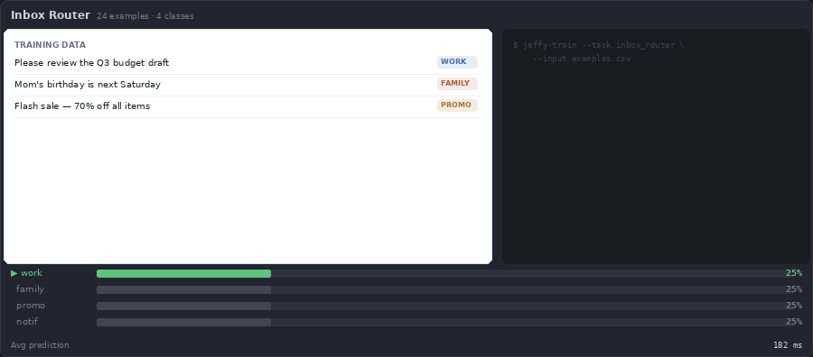
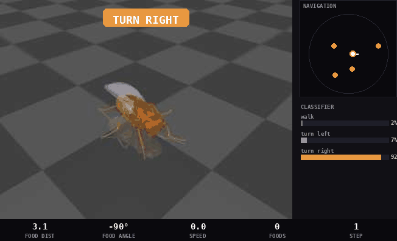
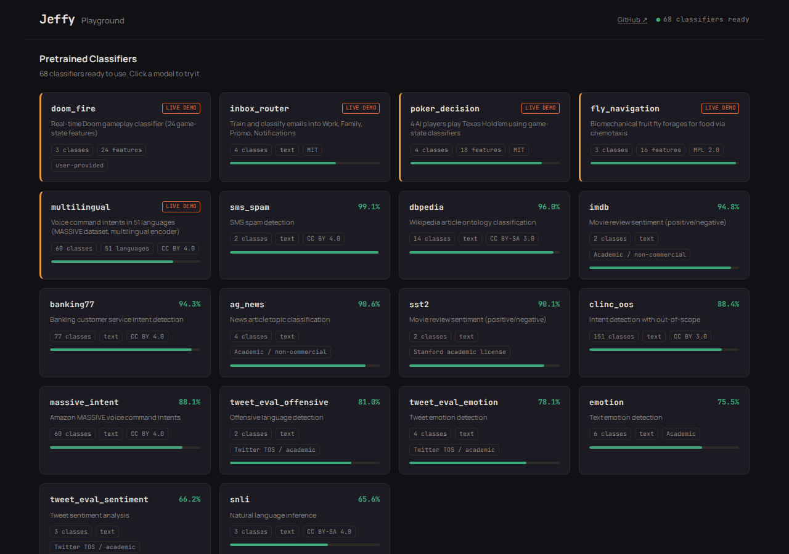
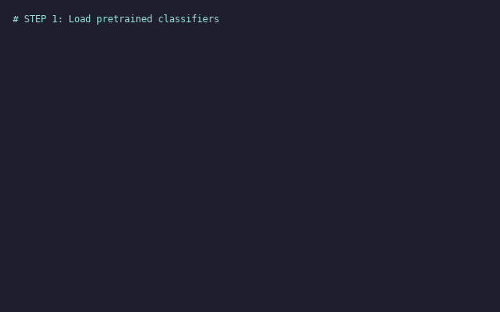

# Jeffy

Pretrained classifiers you can run and retrain on CPU — text, game state, or any numeric features.

**[jeffyclassify.com](https://jeffyclassify.com)** · **[Live Playground](https://playground.jeffyclassify.com)** · **[GitHub](https://github.com/nicobrenner/jeffy)**

<p align="center">
  <a href="https://playground.jeffyclassify.com/#doom"></a>
  <a href="https://playground.jeffyclassify.com/#poker"></a>
</p>
<p align="center">
  <a href="https://playground.jeffyclassify.com/#inbox"></a>
  <a href="https://playground.jeffyclassify.com/#fly"></a>
</p>

## Try it

```bash
pip install jeffy-classify
jeffy-serve
```

Or try without installing (requires [uv](https://docs.astral.sh/uv/getting-started/installation/)):

```bash
uvx --python 3.12 --from jeffy-classify jeffy-serve
```

Open http://localhost:8400, pick a classifier, and paste one of these:

| Classifier | Try this text |
|------------|---------------|
| banking77 | I was charged twice for the same transaction |
| sms_spam | WINNER! You have been selected for a free cruise. Reply YES to claim. |
| ag_news | The Federal Reserve raised interest rates by 25 basis points on Wednesday |

<p align="center">
  
</p>

## Pretrained capabilities

68 classifiers ship with the package — 17 English/general-purpose and 51 multilingual intent classifiers covering languages from Afrikaans to Vietnamese. Weights are logistic regression coefficients (derived model parameters, not copies of training data). Source datasets and licenses are documented in `ATTRIBUTION.md`.

### English / general-purpose

| Task | What it does | Classes | Test Acc | Test F1 |
|------|-------------|---------|----------|---------|
| sms_spam | SMS spam detection | 2 | 99.1% | 98.0% |
| doom_fire | Doom game-state decisions (fire/turn) | 3 | 100.0% | 100.0% |
| fly_navigation | Drosophila connectome navigation | 3 | 98.0% | — |
| dbpedia | Wikipedia article category | 14 | 96.0% | 95.9% |
| imdb | Movie review sentiment (long text) | 2 | 94.8% | 94.8% |
| banking77 | Banking customer intent | 77 | 94.3% | 94.3% |
| ag_news | News topic (world/sports/business/tech) | 4 | 90.5% | 90.5% |
| sst2 | Movie review sentiment | 2 | 90.1% | 90.1% |
| poker_decision | Texas Hold'em poker decisions | 4 | 88.0% | — |
| clinc_oos | Voice assistant intent + out-of-scope | 151 | 88.4% | 92.1% |
| massive_intent | Smart home voice commands (English) | 60 | 88.1% | 86.4% |
| tweet_eval_offensive | Offensive language | 2 | 81.0% | 74.8% |
| tweet_eval_emotion | Tweet emotion | 4 | 78.1% | 74.7% |
| emotion | Text emotion (6 emotions) | 6 | 75.5% | 67.8% |
| inbox_router | Email inbox routing | 4 | 70.8% | 70.8% |
| tweet_eval_sentiment | Tweet sentiment (3-way) | 3 | 66.2% | 65.7% |
| snli | Natural language inference | 3 | 65.6% | 65.2% |

### Multilingual (51 languages)

51 intent classifiers trained on [Amazon MASSIVE](https://huggingface.co/datasets/mteb/amazon_massive_intent) — 60 voice-command intents per language, using frozen multilingual embeddings (`paraphrase-multilingual-MiniLM-L12-v2`, 384-dim) + per-language logistic regression. ~100 KB per classifier, no GPU needed.

| Tier | Languages | Accuracy range |
|------|-----------|---------------|
| Tier 1 (≥80%) | en, fr, pt, zh_cn, id, pl, ru, es, fa, sv, nl, ja, it, tr, el, hi, hu, lv, da | 80.0–86.4% |
| Tier 2 (70–80%) | th, ro, sq, sl, ms, vi, zh_tw, nb, fi, ur, he, hy, mn, my, de, ko, ml, az, te, af, kn | 70.9–79.8% |
| Tier 3 (<70%) | ta, ar, ka, bn, km, am, is, cy, sw, tl, jv | 59.7–69.3% |

Mean accuracy: 75.6% across all 51 languages. Beats XLM-R zero-shot (~70.6%) while being 10,000× smaller per task. See [research](https://github.com/nicobrenner/jeffy-massive-multi-language-paper) for full results.

Test accuracy on held-out splits. Details in `data/eval_results/benchmark.json`. doom_fire and fly_navigation operate on numeric feature vectors instead of text — see `examples/doom/` and `examples/fly/`. inbox_router is a demo classifier trained on 24 examples — see the live demo in the playground.

**Weaknesses:** SNLI (65.6%) and tweet_eval_sentiment (66.2%) are below what task-specific models achieve. Emotion (75.5%) has limited class coverage. Probabilities are uncalibrated.

## Train a custom classifier

```bash
jeffy-train --example --save-dir my_models
```

```
Loaded 24 examples from reviews.csv
Training 'reviews': 24 examples, 2 classes
  Split: 19 train, 5 test
  Test accuracy: 100.0%
Saved to my_models/reviews/
```

`--example` uses a bundled 24-row product review CSV. To bring your own:

```bash
jeffy-train --input your_data.csv --text-col text --label-col label \
  --task-id your_task --save-dir my_models
```

Supports `.csv`, `.tsv`, and `.jsonl`.

## Serve a custom model

```bash
JEFFY_PACK_DIR=my_models jeffy-serve
```

```bash
curl -s -X POST http://localhost:8400/v1/predict \
  -H "Content-Type: application/json" \
  -d '{"text": "The battery life is amazing", "task": "reviews"}'
# → {"label": "positive", "confidence": 0.87, ...}
```

## Install from source

```bash
git clone https://github.com/nicobrenner/jeffy.git
cd jeffy

# With uv (recommended)
uv venv && uv pip install -e .

# Or with pip
python -m venv .venv && source .venv/bin/activate
pip install -e .
```

The first prediction downloads the required encoder(s) — [bge-large-en-v1.5](https://huggingface.co/BAAI/bge-large-en-v1.5) (~1.2 GB) for English tasks, [paraphrase-multilingual-MiniLM-L12-v2](https://huggingface.co/sentence-transformers/paraphrase-multilingual-MiniLM-L12-v2) (~470 MB) for multilingual — cached afterward.

## API

### Python

```python
from jeffy.engine import Engine

engine = Engine()
engine.load()

# List available classifiers
for name, cap in engine.capabilities.items():
    print(f"{name}: {cap.description} ({cap.n_classes} classes)")

# Classify text
result = engine.predict("banking77", "I was charged twice for the same transaction")
print(result["label"])          # "transaction_charged_twice"
print(result["confidence"])     # 0.999
print(result["probabilities"])  # {"transaction_charged_twice": 0.999, ...}
```

### SDK walkthrough



### HTTP

```bash
# Banking intent
curl -s -X POST http://localhost:8400/v1/predict \
  -H "Content-Type: application/json" \
  -d '{"text": "I was charged twice for the same transaction", "task": "banking77"}'
# → {"label": "transaction_charged_twice", "confidence": 0.999, ...}

# Spam detection
curl -s -X POST http://localhost:8400/v1/predict \
  -H "Content-Type: application/json" \
  -d '{"text": "WINNER! You have been selected for a free cruise. Reply YES to claim.", "task": "sms_spam"}'
# → {"label": "spam", "confidence": 0.91, ...}

# News topic
curl -s -X POST http://localhost:8400/v1/predict \
  -H "Content-Type: application/json" \
  -d '{"text": "The Federal Reserve raised interest rates by 25 basis points on Wednesday", "task": "ag_news"}'
# → {"label": "Business", "confidence": 0.86, ...}
```

### List capabilities

```bash
curl -s http://localhost:8400/v1/capabilities | python3 -c "
import json, sys
for c in json.load(sys.stdin)['capabilities']:
    print(f\"{c['task_id']:25s} {c['n_classes']:3d} classes  {c['test_accuracy']:.1%}  {c['name']}\")"
```

### Per-capability metadata

Each shipped classifier has a `manifest.json` with label names, source dataset, HuggingFace path, stated license, encoder identity, training/test counts, and integrity hashes.

```bash
curl -s http://localhost:8400/v1/capabilities/banking77 | python3 -m json.tool
```

## Train from Python

```python
from jeffy.train import train_classifier

clf = train_classifier(
    texts=["great product!", "terrible service", "fast shipping", "broken on arrival"],
    labels=["positive", "negative", "positive", "negative"],
    task_id="my_reviews",
)

result = clf.predict("the quality exceeded my expectations")
print(result["label"])  # "positive"

clf.save("my_models")
```

### Tuning options

| Parameter | Default | Description |
|-----------|---------|-------------|
| `C` | 0.01 | How aggressively the model fits your data. Low (0.001) = conservative, keeps predictions closer to "I'm not sure." High (1.0) = trusts individual training examples more. If the model is great on training data but bad on new data (overfitting), lower C. |
| `test_size` | 0.2 | What fraction of your data to hold back for testing. With 100 examples at 0.2, it trains on 80 and tests on 20. Set to 0 to train on everything (useful when you have very little data and will test manually). |
| `cv_folds` | 3 | Cross-validation: splits your training data into 3 parts, trains on 2 and tests on 1, rotates three times, averages the scores. Gives a more reliable accuracy estimate than a single split. Set to 0 to skip (faster, less reliable estimate). |

Start with the defaults. With <50 examples per class, expect noisy estimates.

## Reproduce the evaluation

```bash
# Install with build dependencies
uv pip install -e ".[build]"
# or: pip install -e ".[build]"

# Retrain all heads from source datasets (~40 min, downloads ~5 GB)
jeffy-build --out data/model_pack

# Evaluate on held-out test sets with tuned baselines
jeffy-evaluate --baselines --latency --device cpu
```

## Evaluation notes

- **SST-2**: Evaluated on `validation` split (official test labels are not public).
- **SMS Spam**: Random split (test_size=0.2, seed=42); no standard benchmark split.
- **SNLI**: Input encoded as `premise [SEP] hypothesis`. Label -1 filtered.
- **CLINC-OOS**: 151 classes including out-of-scope. In-scope accuracy 96.5%, OOS detection 51.7%.
- **MASSIVE**: English head uses config `en`. Multilingual heads cover 51 languages — see the multilingual table above.

## Deployment

| Component | Size | Required for |
|-----------|------|-------------|
| Jeffy package (wheel) | ~6 MB | Always (includes all 68 classifiers) |
| Encoder (bge-large-en-v1.5) | ~1.2 GB | English tasks (downloaded on first use) |
| Encoder (paraphrase-multilingual-MiniLM-L12-v2) | ~470 MB | Multilingual tasks (downloaded on first use) |
| `datasets` package | ~100 MB | Retraining from HuggingFace only |

Runtime memory: ~2 GB with English encoder, ~2.5 GB with both loaded. Encoders shared across all heads.

**Latency** (CPU, single example, Linux aarch64):

| Stage | p50 | Notes |
|-------|-----|-------|
| Embedding | 50–80 ms | Dominates; varies with input length |
| Classifier | <1 ms | Negligible |
| Total | 50–80 ms | End-to-end |

## Model security

Bundled pretrained artifacts use numpy `.npz` format (portable, no pickle). Custom-trained models also save a joblib pickle backup. **Only load custom pickle artifacts from trusted sources.** Each artifact's `manifest.json` includes integrity hashes verified on load.

## Provenance and licensing

Jeffy code is MIT-licensed. Head artifacts are derived from public datasets; redistribution permissions have **not been independently verified** for all sources. See `ATTRIBUTION.md` for per-dataset license status.

| Dataset | Stated license |
|---------|---------------|
| banking77, massive_intent, sms_spam | CC BY 4.0 |
| clinc_oos | CC BY 3.0 |
| dbpedia | CC BY-SA 3.0 |
| snli | CC BY-SA 4.0 |
| ag_news, imdb | Academic / non-commercial |
| sst2 | Stanford academic license |
| emotion | Academic |
| tweet_eval_* | Twitter TOS / academic |

The encoder ([bge-large-en-v1.5](https://huggingface.co/BAAI/bge-large-en-v1.5)) is MIT-licensed.

## Tested

Verified with clean-environment wheel and sdist install on Linux aarch64, Python 3.12, scikit-learn 1.9+, sentence-transformers 6.1+, numpy 2.5+. Pretrained artifacts use numpy `.npz` format, avoiding sklearn version coupling.

## What's not included

- **No zero-shot / general classification.** Each task needs a trained head. Unknown tasks return an error.
- **No LLM fallback.** This release is pure embedding + classifier.
- **No automatic task routing.** You must specify which classifier to use.
- **No hosted service.** Runs locally; [playground.jeffyclassify.com](https://playground.jeffyclassify.com) is a demo, not a production API.

## Roadmap

| Status | Milestone |
|--------|-----------|
| **Available** | Pretrained classifier library (68 classifiers across 51 languages), SDK/API, custom training from CSV/JSONL |
| **Available** | PyPI package (`pip install jeffy-classify`), non-text classifiers (numeric feature vectors) |
| **Available** | Classifier catalog UI with model detail pages, live try-it forms, and usage snippets |
| **Available** | Live Doom demo — real-time VizDoom classifier streaming in the playground |
| **Available** | Inbox classifier demo — animated training + classification workflow |
| **Available** | Poker AI demo — 4 AI players streaming Texas Hold'em decisions live |
| **Available** | Landing page at [jeffyclassify.com](https://jeffyclassify.com), live playground at [playground.jeffyclassify.com](https://playground.jeffyclassify.com) |
| **Available** | Multilingual classifiers — 51 languages via frozen multilingual embeddings + per-language logistic regression ([research](https://github.com/nicobrenner/jeffy-massive-multi-language-paper)) |
| **Next** | [Live demos for more classifiers, broader catalog released in verified batches](https://github.com/nicobrenner/jeffy/issues/2) |
| **Planned** | [Automatic routing among supported classifiers](https://github.com/nicobrenner/jeffy/issues/3) |
| **Planned** | [Optional local/API LLM fallback for unsupported tasks](https://github.com/nicobrenner/jeffy/issues/4) |
| **Planned** | [Hosted classifier catalog and decision-routing service](https://github.com/nicobrenner/jeffy/issues/5) |
| **Planned** | [Embeddable preference recorder](https://github.com/nicobrenner/jeffy/issues/6) — a drop-in integration for web platforms that trains classifiers from live human decisions and contextual data, capturing expertise as reusable models |
| **Exploring** | [Assisted labeling, retraining from corrections, classifier sharing](https://github.com/nicobrenner/jeffy/issues/7) |

[Vote on what you want to see next →](https://github.com/nicobrenner/jeffy/issues) Comment on an issue or open a new one with your use case.
